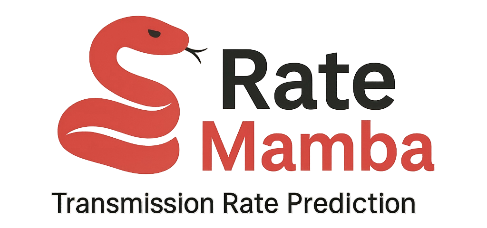
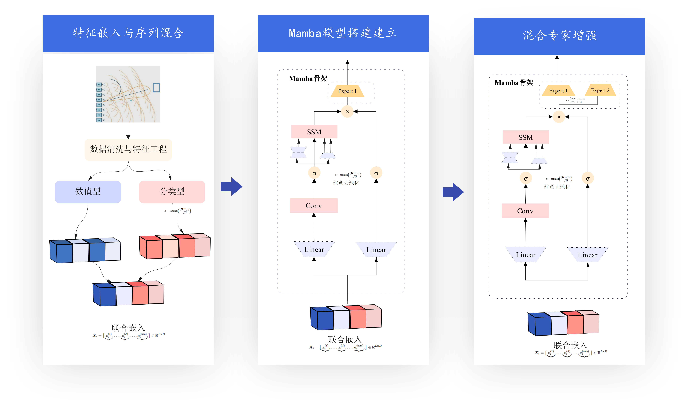
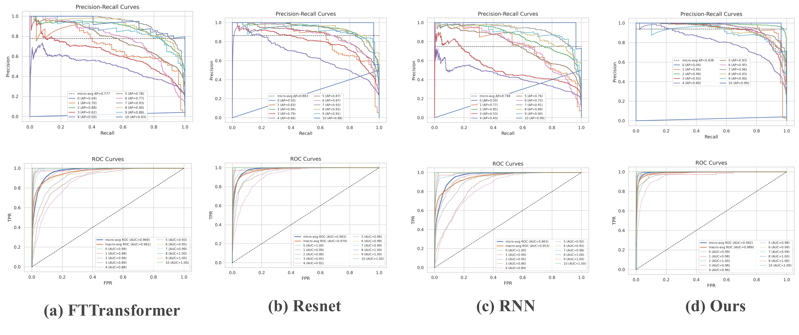

# 🚀 RateMamba | 面向无线通信的 Mamba 架构域自适应速率预测

<p align="center">
  
</p>

<p align="center">
  <a href="https://www.python.org/"></a>
  <a href="https://pytorch.org/"></a>
  <a href="https://github.com/MAXIMUM950814/RateMamba/actions"></a>
  <a href="https://opensource.org/licenses/MIT"></a>
  <a href="https://github.com/MAXIMUM950814/RateMamba/stargazers"></a>
</p>

<p align="center">
  <strong>语言:</strong>
  <a href="./README.md">English</a> |
  中文
</p>

---

## 📖 摘要
面向多天线、多载波与波束赋形条件下的无线链路速率预测，本文从空间/频域关联性出发，研究域自适应与序列建模的联合方法。针对问题一，采用指数有效 SINR 映射（EESM）并以 Spearman 相关为目标、由 Nelder–Mead 优化 α、β 参数，实现非 TxBF 场景下的统一表征；结果表明：子载波间相关显著，EESM 能较好刻画频域特征，拟合参数在不同子集间具备可迁移性，链路突变时虽存在偏差但整体稳定。针对问题二，提出基于 Mamba 的序列编码框架，结合均值/注意力池化与 FiLM 域条件仿射调制以缓解“回归到均值”，相较 FTTransformer、ResNet、RNN 等基线，平均 F1 提升约 10%，均值误差下降，尾部样本识别增强，并在 RMSE、MAE、R² 等多指标上全面优于对比方法。针对问题三，构建共享编码器 + FiLM + 双专家任务头的域自适应模型，通过域路由选择专属预测头以联合建模 Non-TxBF 与 TxBF；在不牺牲任务精度的前提下跨域总体准确率提升 7%，方差更低、稳定性更强。尽管在极度不均衡样本下仍存在偏差，所提方法总体预测稳定性与泛化性能得到显著提升。


## 📸 示例效果

**架构图**
<p align="center">
  
</p>

**Non-TxBF vs TxBF**各类结果比较
<p align="center">
  
  
</p>
**结果曲线图**

<p align="center">
  
</p>
<p align="center">
  
</p>

---

## ⚡ 快速开始
| 步骤 | 命令                                                  |
| ---- | ----------------------------------------------------- |
| 1    | `git clone https://github.com/MAXIMUM950814/RateMamba.git` |
| 2    | `cd RateMamba`                                        |
| 3    | `pip install -r requirements.txt`                     |

---

## 📦 安装方法
```bash
git clone https://github.com/MAXIMUM950814/RateMamba.git
cd RateMamba
pip install -r requirements.txt
```

## 📂 项目结构

```
RateMamba/
├─ datasets/
│   ├─ feature_map
├─ docs/
├─ models/
├─ notebook/
├─ results/
│   ├─ q1_eesm
│   ├─ q2_mamba
│   ├─ q3_mamba
│   ├─ q3_mamba_non
├─ utils/
├─ main.py
├─ requirements.txt
└─ README.md
```


🚀 实验流程
**步骤 1: 数据预处理与 SINR 计算**
运行以下脚本，读取数据并计算逐子载波 SINR：

```
python .\models\eesm.py
```

**步骤 2: 基于 EESM 的等效 SINR 映射**
运行 EESM 模型，将逐子载波 SINR 映射为等效 SINR，并生成 Valid_Predict：

```
python .\models\eesm.py \
  --train '/mnt/j/workspace/2025math/datasets/train_all_non_txbf.csv' \
  --valid '/mnt/j/workspace/2025math/datasets/valid_all_non_txbf.csv' \
  --per_sc_col sinr_per_sc_non \
  --label_col mcs \
  --outdir .results/eesm_out
```

**步骤 3: 训练 RateMamba 模型**
RateMamba 框架用于信道传输速率预测，流程包括：

**1、特征嵌入**

```
python .\datasets\feature_embedding.py
```

**2、模型训练与预测**

```
python main.py
```

或使用提供的 Jupyter Notebook 分步运行实验：

```
notebook\mambular-baseline.ipynb 
notebook\mambular-nontxbf-2moe.ipynb 
notebook\mambular-txbf-2moe.ipynb 
notebook\mambular-txbf.ipynb
```

**📊 实验结果与输出**
所有实验结果保存在 results 文件夹中：

**任务 1（SINR计算，等效 SINR 映射，建立mcs索引）**
存储在 `\results\q1_eesm` 中，包括结果、图表和参数文件。
预测结果：`valid_non_txbf_predict.csv`

**任务 2（非 TxBF 场景速率预测）**
存储在 `\results\q1_eesm` 中，包括结果、图表、参数和模型权重文件。
预测结果：`valid_pre_non_txbf_predict.csv`

**任务 3（TxBF 与非 TxBF 场景速率预测）**
存储在 `\results\q3_mamba` 和 `\results\q3_mamba_non` 中，包括结果、图表、参数和模型权重文件。
预测结果存储在`valid_pre_txbf_predict.csv`和`valid_pre_non_txbf_predict.csv`文件中。

## 👥 贡献者
<p align="left"> <a href="https://github.com/Watch-A">Watch-A</a> </p> <p align="left"> <a href="https://github.com/ArcadiaLin">ArcadiaLin</a> </p>

## 📜 许可证 (MIT)

本项目全部代码基于 MIT License 开源。